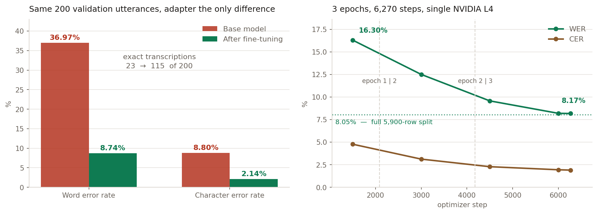

# Neyshekar Persian ASR — fine-tuning Whisper large-v3 with QLoRA

Fine-tuning `openai/whisper-large-v3` on the Neyshekar Persian speech corpus using QLoRA
(4-bit NF4 base + LoRA adapters), with the data investigation, training analysis and error
analysis that go with it.

**Adapter:** [`hosseinzr/neyshekar-whisper-large-v3-lora`](https://huggingface.co/hosseinzr/neyshekar-whisper-large-v3-lora) ·
**Data:** [`shekar-ai/neyshekar-v4-persian-asr-fa`](https://huggingface.co/datasets/shekar-ai/neyshekar-v4-persian-asr-fa)

---

## The short version



**8.05% word error rate on the full 5,900-row validation split.** Measured against the untouched
base model on identical audio, identical settings and the same 200 utterances, that is
**36.97% → 8.74%** — the two figures differ because they are measured on different sets, and the
comparison is only meaningful within one of them. Three epochs of QLoRA on a single 22 GB L4,
14 h 19 min, 1.01% of the model's parameters trained, peak memory 5.51 GiB.

The left panel is the before-and-after with the adapter as the only variable. The right panel is
the run itself; the last 270 steps moved WER by 0.02 points, which is smaller than the
disagreement between two measurements of the same checkpoint, so the model had stopped improving
before the epoch budget ran out.

Three things are worth more than the headline number:

- **The base model never writes a zero-width non-joiner. The adapted one writes 116**, against
  118 in the references. It learned a Persian orthographic convention that WER barely registers.
- **A quarter of the remaining errors are not mishearings.** Task 4 takes 156 error events apart
  by hand: 25.6% are spelling conventions where the model heard the word correctly and wrote it
  by a different rule. Rescoring with the half-space normalised moves WER by 0.53 points.
- **51.9% of validation transcripts also occur in training**, with different audio. The split is
  disjoint by recording but not by sentence, which flatters validation loss in particular. This
  is stated here rather than left to be discovered.

If you have five minutes rather than two: [Task 4](docs/Task4_Error_Analysis.docx) is the error analysis and the most
interesting of the five documents. If you have a terminal, `docker run` below gives you a working
transcription service.

---

## Results

Final metrics, measured once at the end over the **full 5,900-row validation split**:

| | WER | CER |
|---|---:|---:|
| **Fine-tuned adapter** | **8.05%** | **2.00%** |

A number on its own says nothing, so the same 200 validation utterances were also transcribed by
the untouched base model. Both runs use the identical 4-bit load path, preprocessing and
generation settings, so the adapter is the only variable:

| Scored over the same 200 utterances | Base model | After fine-tuning | Change |
|---|---:|---:|---:|
| Corpus WER, normalised | 36.97% | 8.74% | −28.2 points |
| Corpus CER, normalised | 8.80% | 2.14% | −6.7 points |
| Transcribed exactly | 23 (11.5%) | 115 (57.5%) | 5× more |
| Predictions containing a digit | 4 | 0 | eliminated |
| Predictions using a ZWNJ | 0 | 116 | learned |

The last two rows are worth more than the WER. Task 1 spelled every number out in words, so a
digit in the output is a convention the model has not picked up — after fine-tuning there are
none. The zero-width non-joiner is the opposite case: the base model never emits one, the
adapted model emits 116 against 118 in the references. It learned a Persian orthographic
convention that is invisible to WER alone.

Progress during the run, on a fixed 500-row subset:

| Step | Epoch | Train loss | Val loss | WER % | CER % |
|---:|---:|---:|---:|---:|---:|
| 1,500 | 0.72 | 0.4192 | 0.1615 | 16.30 | 4.77 |
| 3,000 | 1.44 | 0.2081 | 0.1288 | 12.50 | 3.12 |
| 4,500 | 2.15 | 0.1110 | 0.1007 | 9.57 | 2.28 |
| 6,000 | 2.87 | 0.0779 | 0.0870 | 8.19 | 1.94 |
| 6,270 | 3.00 | 0.0678 | 0.0857 | 8.17 | 1.90 |

---

## Where each requirement is answered

| Asked for | Answered in | Key result |
|---|---|---|
| Dataset investigation | [`docs/Task1_Dataset_Investigation.docx`](docs/Task1_Dataset_Investigation.docx) · `data_prep.py` · `src/run_step*.py` | 40,008 raw rows → 39,332 cleaned |
| Training pipeline | [`docs/Task2_Training_Pipeline.docx`](docs/Task2_Training_Pipeline.docx) · `train.py` · `src/model.py` | WER 8.05%, CER 2.00% on the full split |
| Analysis of the learning process | [`docs/Task3_Training_Analysis.docx`](docs/Task3_Training_Analysis.docx) · `plot_training.py` | Converged by step 6,000; no overfitting |
| Error analysis | [`docs/Task4_Error_Analysis.docx`](docs/Task4_Error_Analysis.docx) · `analyze_errors.py` · `categorise_errors.py` | 156 error events, 25.6% orthographic |
| Engineering and reproducibility | [`docs/Task5_Engineering.docx`](docs/Task5_Engineering.docx) · `src/paths.py` | No hard-coded paths; five were removed |
| Dockerised inference | `Dockerfile` · `serve.py` · [below](#inference-service-docker) | CPU image, `POST /transcribe` |
| Deterministic seed | `src/config.py` → `set_seed()` | `SEED = 42` across Python, NumPy, torch, CUDA |

**Repository layout.** The real modules live in `src/`. The six files of the same name in the
root — `config.py`, `dataset.py`, `metrics.py`, `model.py`, `train.py`, `data_prep.py` — are
eleven-line launchers that re-export from `src/`, so that `python train.py` works from the
repository root as this README describes. They are not second copies; there is one definition of
everything and it is in `src/`.

---

## What each document found

Five documents in [`docs/`](docs/), about thirty pages. This is what is in them, so the rest of
this page can be skipped if the conclusions are all that is wanted.

**[Task 1 — Dataset Investigation](docs/Task1_Dataset_Investigation.docx)**
40,008 raw rows became 39,332. Nothing was unreadable — zero corrupt files — but the corpus
repeats itself badly: 39,332 records over 26,626 distinct transcripts, one sentence appearing
eleven times. 28.06% of clips have a low character-per-second rate, which is long edge silence
rather than slow speech, and 22.10% peak at the digital ceiling. Both became preprocessing steps
in Task 2. Two decisions are recorded with their cost rather than buried: 80.9% of labels contain
punctuation the scorer strips, and the zero-width non-joiner was deliberately left un-normalised,
which is worth 0.53 WER points.

**[Task 2 — Training Pipeline](docs/Task2_Training_Pipeline.docx)**
QLoRA is justified by arithmetic, not by fashion: a full fp32 fine-tune needs 23.2 GiB of
training state against 22.03 GiB available on the card, and QLoRA needs 0.96 GiB. That is the
whole argument. Train and validation are joined on the `id` primary key rather than on transcript
text, because ~59% of rows share a duplicated transcript and a text join silently pairs sentences
with the wrong audio — two earlier versions of that function got it wrong in two different ways,
and both are documented. Ends with the zero-shot comparison.

**[Task 3 — Analysis of the Learning Process](docs/Task3_Training_Analysis.docx)**
The loss does not fall evenly. 34% of the total reduction happens at the two epoch boundaries,
instants where nothing about the optimiser changes and the only new fact is that the model is
seeing examples it has already seen — so that improvement is re-exposure, not generalisation.
Validation loss starts *below* training loss and the two cross during epoch 3, which looks wrong
and is not; the document explains why. The model had converged by step 6,000. Training was stable:
one NaN gradient norm at step 1,080, which was the fp16 scaler skipping an overflow, and the
arithmetic rules out the clipped audio as its cause.

**[Task 4 — Error Analysis](docs/Task4_Error_Analysis.docx)**
The most interesting of the five. 156 word-level error events, categorised by hand after a first
mechanical attempt proved useless. **25.6% are not mishearings** — the model heard the word
correctly and spelled it by a different Persian convention. The remaining 74.4% are genuine, and
reading them gives five causes: compound spacing has no settled standard, several Persian letters
are pronounced identically, word boundaries dissolve in connected speech, the model normalises
colloquial speech toward formal written Persian, and rare words lose to frequent ones. Three
categories the brief asked about do not occur at all, and the absence is worth as much as the
presence. Ends with a four-item plan for one more week.

**[Task 5 — Engineering](docs/Task5_Engineering.docx)**
An index rather than an argument: each criterion, the file that satisfies it, the evidence. Five
files carried hard-coded drive paths and were replaced with a single resolver. The notebooks are
launchers with no analysis hidden in them. It also states where the work falls short — the exact
training environment was never captured with `pip freeze`.

---

## Hear it

**▶ [Open the live demo](https://hosseinzzare.github.io/neyshekar_asr/demo.html)** — five validation
clips with a player, the reference text, and what the model produced, differing words marked.

These are real requests to the container: each clip was posted to `POST /transcribe` on the
CPU-only image and scored with the project's own normaliser. The audio is committed (the corpus
is CC0-1.0), so nothing needs downloading to try it.

| Clip | Reference → model | WER | What happened |
|---|---|---:|---|
| `val_16322` | identical | 0.0% | exact |
| `val_31021` | identical | 0.0% | exact |
| `val_33008` | `این همه` → `این‌همه` | 28.6% | compound written with a half-space instead of a space |
| `val_17098` | `خیلی‌ام` → `خیلی هم` | 66.7% | half-space compound split into two words |
| `val_37678` | four differences | 40.0% | fastest speech in the set — 99th percentile |

**Two of five are exact. Four of the eight word errors are spacing conventions, not mishearings**
— the same category Task 4 measured at 25.6%, turning up again on clips the analysis never saw.

The 24.2% overall on these five against 8.05% on the full split is small-sample noise, not a
contradiction: `val_17098` is three words long, so two errors put it at 66.7% by itself. Five
sentences is a demonstration, not a measurement.

Regenerate or extend the set with `python make_test_clip.py --dataset_path "<corpus>" --n 5`.

---

## What was done

**Data.** 40,008 raw rows → 39,332 after cleaning → 33,432 train / 5,900 validation.
Cleaning covers Arabic→Persian character folding, numbers written out as words
(`num2fawords`), whitespace and punctuation normalisation, and exact deduplication on the
audio hash and transcript together. Two findings drove preprocessing choices: 28.06% of clips
have a low character-per-second rate, usually long leading or trailing silence, and 22.10%
touch the digital ceiling. Whisper hallucinates text over silence, so edge silence is trimmed
before feature extraction — pauses *inside* an utterance are natural speech and are kept. Every
clip is peak-normalised to −3 dBFS, which gives a consistent dynamic range but cannot repair
audio that was already clipped.

**Training.** 3 epochs, 6,270 optimizer steps, effective batch 16 (8 × 2 accumulation),
learning rate 1e-3 with 50 warmup steps and linear decay, fp16. LoRA `r=32`, `alpha=64`,
`dropout=0.05` on `q_proj` and `v_proj`: **15,728,640 of 1,559,219,200 parameters, 1.01%**.
Checkpoint selection ran on WER, not loss.

**Cost.** 14 h 19 min on a single NVIDIA L4. Peak memory **5.51 GiB of the 22.03 GiB
available** — the card was never the constraint, gradient checkpointing was (two ablation runs
with it disabled both died with CUDA OOM; see `ablation_logs.tar.gz` in the model repository).
The final full-split evaluation took a further 1 h 53 min on its own, because every evaluation
runs autoregressive `generate()` rather than teacher forcing.

---

## Setup

```bash
git clone https://github.com/hosseinzzare/neyshekar_asr.git
cd neyshekar_asr

python -m venv .venv
source .venv/bin/activate      # Windows: .venv\Scripts\activate

pip install -r requirements.txt
```

`requirements.txt` declares floors rather than pins. The exact environment of the published run
was not captured with `pip freeze` before the machine was released — that is the one real gap in
this project's reproducibility and is recorded here rather than papered over. What the training
log does establish is transformers 5.x, and the code calls `from_pretrained(dtype=...)`, which is
the 5.x signature, so the floor is set accordingly. For a run that must be reproduced exactly,
capture `pip freeze > requirements.lock` alongside the checkpoint.

Optionally set `HF_TOKEN` for higher download rate limits.

---

## Running it

### Preprocess (Task 1)

The committed CSVs are already the cleaned output, so this is only needed if the cleaning rules
change.

```bash
export NEYSHEKAR_RAW_DIR="/path/to/neyshekar dataset"   # Windows: set NEYSHEKAR_RAW_DIR=E:\neyshekar dataset
python data_prep.py
```

No path is hard-coded anywhere. Every script that reads the raw corpus resolves it through
`src/paths.py`: `--dataset_path`, then `NEYSHEKAR_RAW_DIR`, then a clear error. There is
deliberately no default — guessing would fail later and less clearly than saying so up front.

### Smoke test

```bash
python train.py --max_steps 30 --max_shards 2 --output_dir ./whisper-large-v3-smoke-test
```

`--max_shards 2` downloads two parquet shards (~1 GB) instead of the full ~7.3 GB. Two shards
give roughly 4,500 train and 816 validation rows, enough to exercise the whole path including
evaluation, WER/CER and checkpointing.

### Full run

```bash
python train.py --max_steps -1 --epochs 3 --final_full_eval \
    --output_dir ./whisper-large-v3-neyshekar-qlora
```

Evaluation is the expensive part: one pass over the 500-row subset costs about 10 minutes, and
the full 5,900-row split costs nearly two hours. `eval_steps` and `save_steps` are therefore
1,500, giving five curve points, and `--final_full_eval` computes the headline figures once on
the whole split at the end. These are the values the published run used; `src/config.py` holds
them so a fresh clone reproduces it.

### CLI arguments

| Argument | Default | Description |
| :--- | :--- | :--- |
| `--max_steps` | `-1` | `-1` runs the full epoch count |
| `--epochs` | `3` | |
| `--output_dir` | `./whisper-large-v3-neyshekar-qlora` | Checkpoints and adapter weights |
| `--train_csv` / `--val_csv` | `data/train.csv` / `data/val.csv` | |
| `--eval_steps` / `--save_steps` | `1500` | Auto-scales down during smoke tests so the eval path is actually exercised |
| `--max_eval_samples` | `500` | Rows used for periodic evals. `-1` = always the full split |
| `--max_shards` | all | Download only the first N shards (~485 MB each). Smoke tests only |
| `--no_quantization` | off | Load the base model in bf16 instead of 4-bit NF4. Lets LoRA adapt exact weights; needs ~2.2 GB more VRAM |
| `--no_gradient_checkpointing` | off | **Measured to OOM on the 22.03 GiB L4.** Not a knob on this hardware |
| `--train_batch_size` / `--grad_accum` | `8` / `2` | Keep the product at 16 to preserve the learning-rate recipe |
| `--eval_batch_size` | `8` | Affects evaluation speed only, never WER/CER |
| `--no_vad_trim` / `--no_peak_norm` | off | Disable the Task 1 audio preprocessing |
| `--final_full_eval` | off | Evaluate once on the full validation set and write `final_eval_metrics.json` |

Metrics are written to `./logs`; view with `tensorboard --logdir ./logs`.

---

## Inference service (Docker)

The trained adapter is packaged as an HTTP service so the model can be used without installing
anything.

```bash
docker build -t neyshekar-asr .

# -v keeps the 3 GB base model between runs; without it every start re-downloads it.
docker run -p 8000:8000 -v neyshekar-cache:/cache neyshekar-asr
```

Then open <http://localhost:8000> for a small upload form, or call it directly:

```bash
curl -F "file=@clip.wav" http://localhost:8000/transcribe
# {"text":"سلام روز شما بخیر","audio_seconds":2.4,"compute_seconds":31.8,"device":"cpu"}

curl http://localhost:8000/health
# {"status":"ready","device":"cpu","quantised":false,...}
```

| Endpoint | Purpose |
|---|---|
| `GET /` | one-page upload form |
| `GET /health` | `200` once the model is loaded, `503` before that or if loading failed |
| `POST /transcribe` | multipart audio file → `{"text": ...}` |

**First start downloads about 3 GB** (the `whisper-large-v3` base weights) and the service
answers `503` on `/health` until that finishes. The 63 MB adapter is pulled from the Hub at the
same time. Both are cached in the volume.

**The image is CPU-only.** 4-bit quantisation needs CUDA, so on a machine without a GPU
`serve.py` loads the base model in float32 instead. It produces the same transcripts, at roughly
7× slower than real time rather than about one second per clip. For a GPU host, change the base
image in the `Dockerfile` to a CUDA runtime and add `bitsandbytes` to `requirements-docker.txt`
— `serve.py` already takes the quantised path when a GPU is visible.

Audio is preprocessed by the same `trim_silence` and `peak_normalize` used in training, imported
from `src/dataset.py` rather than reimplemented, so the service cannot silently drift away from
the pipeline the reported WER was measured on.

| Environment variable | Default |
|---|---|
| `ADAPTER_ID` | `hosseinzr/neyshekar-whisper-large-v3-lora` |
| `BASE_MODEL` | `openai/whisper-large-v3` |
| `MAX_UPLOAD_MB` | `25` |
| `HF_HOME` | `/cache` |

### Testing it on real audio

The corpus ships as parquet with the audio inline; there are no loose `.wav` files. This pulls
clips out of the **validation** split, so they are audio the adapter never trained on, and prints
the reference transcript beside each one:

```bash
python make_test_clip.py --dataset_path "/path/to/neyshekar dataset" --n 5
curl -F "file=@test_clips/val_16322.wav" http://localhost:8000/transcribe
```

The five clips used by the live demo are already committed; this regenerates them or writes
more. Open `demo.html` locally, or use the published page linked above.

---

## Known limitations

- **Validation overlaps training by transcript.** 51.9% of validation transcripts also occur in
  the training split with different audio. The split is disjoint by recording but not by
  sentence, so validation loss in particular is optimistic — teacher forcing on a sentence the
  decoder has already learned is close to trivial. A transcript-disjoint split should have been
  the default from the start. Task 1 and Task 3 quantify the effect.
- **Clipped audio was not repaired.** 22.10% of clips hit the ceiling; that information is gone
  and peak normalisation cannot bring it back.
- **The exact training environment was not captured.** See the note under Setup.
- **Batch composition is not logged.** Which sample ids were in which batch is not recorded, so
  questions like "did clipped audio cause the one fp16 overflow" can be argued from
  probabilities but not settled. Task 3 does the arithmetic.

---

Developed for a Persian speech recognition assessment.
