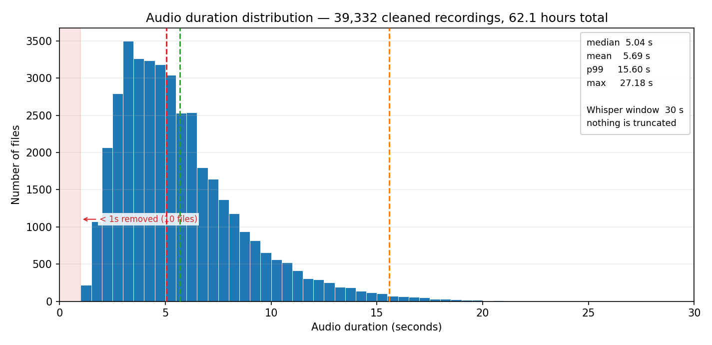
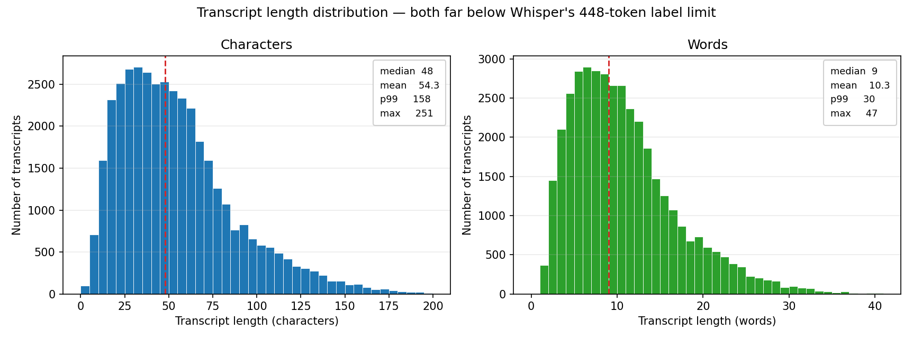
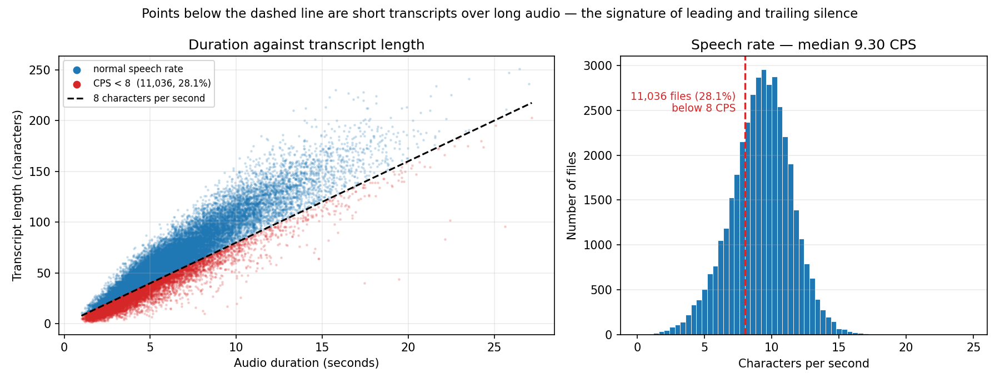

# Task 1 — Dataset Investigation

## 1. What assumptions can you make about the dataset?

Before applying any preprocessing to the raw Neyshekar dataset, I made the following assumptions about data quality and distribution. Each one is a hypothesis that the exploratory phase then had to confirm or reject, and each one is stated in the form of something that could turn out to be false.

**1. Hallucination-prone samples.** Given Whisper's autoregressive decoder, I assume some portion of the dataset contains long silences, empty audio, or noise-only segments. These do not produce empty output. They produce hallucinated speech or infinite word repetition, because the decoder is trained to emit tokens and will keep emitting them when the encoder gives it nothing to condition on.

**2. Duration outliers.** Whisper's feature extractor operates on a fixed 30-second window, so I assume the dataset contains files that violate the useful range: under 1 second, or over 30 seconds. Audio below 1 second lacks the phonetic context the encoder needs; audio above 30 seconds is silently truncated, which destroys the alignment between the audio and its transcript. The Neyshekar dataset card states that all files are at most 27 seconds, but a claim on a dataset card is not a measurement, so this has to be verified directly.

**3. Textual and orthographic anomalies.** I assume the transcripts are not normalised. Persian text in the wild routinely contains Arabic codepoints — `ي` and `ك` instead of `ی` and `ک` — which the tokenizer treats as entirely separate symbols, splitting what should be one embedding across two. I also assume numbers appear as digits rather than spelled out, which is a direct mismatch with the audio, where they are spoken as words.

**4. Audio–text misalignment.** I assume some rows have an implausible ratio between audio duration and transcript length: several seconds of audio for a single word, or a long sentence over very short audio. This is detectable as outliers in the distribution of speech-rate metrics — words per second and characters per second — without needing to listen to anything.

**5. Duplication.** I assume duplicate rows exist, in text, in audio, or both. Left in place they inflate the effective weight of particular sentences, which pushes the model toward memorisation rather than generalisation.

**6. Sampling-rate and format inconsistency.** Whisper's encoder operates exclusively at 16 kHz. The dataset card claims all audio is already 16 kHz, but as with the duration claim I assume this may not hold for every file, and resampling must be applied defensively rather than trusted.

---

## 2. Are there duplicated transcripts?

Yes, and they need to be separated into kinds before deciding what to do, because in ASR the word "duplicate" covers two opposite situations. The same transcript paired with **different** audio is valuable — it gives the model the same sentence across different speakers, accents and recording conditions, which is exactly the acoustic variation it needs to generalise. The same transcript paired with the **same** audio is pure redundancy, and a sentence repeated many times over becomes a hallucination trigger.

### Normalising first

Comparing raw strings would have produced false negatives, since two identical sentences typed with different conventions do not match as strings. So text was standardised across all 40,008 raw records before any comparison:

| anomaly | records | share | action |
|---|---:|---:|---|
| Arabic characters (`ي`, `ك`) | 1,480 | 3.70% | converted to Persian `ی`, `ک` |
| numeric digits | 1,191 | 2.98% | lexicalised — `۱۲` becomes `دوازده` |

Verification after the pass confirmed zero remaining Arabic characters and zero remaining digits.

A temporary `text_fingerprint` column was then built by stripping spaces, zero-width non-joiners, diacritics and punctuation. This exists only to answer "are these the same sentence" and is never used as a training label — a transcript without spaces is not a transcript, and word error rate cannot be computed on one.

### The deduplication policy

| category | rule | records | action |
|---|---|---:|---|
| exact row duplicates | identical audio **and** identical text | 134 | dropped entirely |
| short conversational phrases | fewer than 15 characters or fewer than 4 words | 3,479 | preserved in full |
| long repeats, 2–3 copies | | 18,520 | preserved in full |
| long repeats, more than 3 copies | capped at 3 | 1,191 kept | 532 excess copies dropped |

The three thresholds are the only judgement calls, and each has a reason. Short phrases like `سلام` or `بله` are exempt because they genuinely recur at high frequency in any speech corpus — that is a property of spoken Persian, not a defect in the data, and removing them would bias the model against the most common utterances it will encounter. The cap of three on long sentences is the compromise between the two failure modes: below it, multi-speaker variety is thrown away; above it, a single sentence gets enough weight to start pulling the decoder toward reciting it.

**Result:** 666 records removed from 40,008, leaving 39,342 — a retention rate of 98.34%.

### Duplication across the train/validation split

The analysis above concerns duplication *within* the dataset. There is a second form that matters more for how the final numbers should be read.

The split was made on the unique `id`, so no recording appears in both halves — verified, the id overlap is exactly zero. But the split was not made on transcript content, and because the same sentence is often recorded by several speakers, the same *text* can land on both sides:

| measure | value |
|---|---:|
| validation rows whose transcript also occurs in training | 3,061 (51.9%) |
| of those, long transcripts (≥15 chars and ≥4 words) | 2,595 (44.0% of validation) |
| recordings shared between splits | 0 |

This is not leakage in the strict sense. No validation waveform was trained on, and the acoustic task on those rows is genuinely unseen. But Whisper is an encoder–decoder model, and its decoder is a language model: for half the validation set it is producing a sentence it has already been trained to produce. The reported validation WER is therefore optimistic relative to performance on genuinely unseen sentences, and the 44% figure shows this is not explained away as an artefact of common short phrases.

The honest fix would be a transcript-disjoint split, where no fingerprint appears on both sides. That was not done here, because the split was already fixed before this was measured and re-splitting would have invalidated the training run. It is recorded as a known limitation of the reported metrics rather than left for a reader to discover.

---

## 3. Are there invalid audio files?

Yes, but they are a negligible fraction. "Invalid" here means corrupted, silent, or outside the temporal range Whisper can actually use.

To check this without decoding 7 GB of audio into memory, I ran a vectorised header scan across all 40,008 samples.

| check | result |
|---|---|
| unreadable or corrupted headers | 0 |
| absolute digital silence (all-zero amplitude) | 0 |
| files longer than 30 s | 0 |
| files shorter than 1.0 s | 10 |

**On the duration ceiling.** The measured maximum is **27.18 seconds**. This is worth stating precisely, because the dataset card claims a maximum of 27 seconds and the true value exceeds it — slightly, by 0.18 s, but it exceeds it. The card's claim is approximately right and not exactly right. The practical conclusion is unchanged: nothing is anywhere near the 30-second boundary, so no file is truncated and no audio–text alignment is broken by the feature extractor. The point of measuring rather than trusting is that this conclusion is now established rather than assumed.

**On the floor.** The 10 sub-second files were dropped. Below roughly one second there is not enough context for the encoder to produce a meaningful representation, and these contribute noise to the gradient rather than signal.

**Resulting dataset.** After deduplication and audio validation, 39,332 records remain.

| statistic | value |
|---|---:|
| records | 39,332 |
| total audio | 62.1 hours |
| duration — mean | 5.69 s |
| duration — median | 5.04 s |
| duration — standard deviation | 2.98 s |
| duration — min / max | 1.02 s / 27.18 s |
| duration — 95th / 99th percentile | 11.54 s / 15.60 s |

The gap between the median of 5.04 s and the maximum of 27.18 s, with the 99th percentile at 15.60 s, describes a distribution with a long thin right tail. This matters for training throughput rather than correctness: every sample is padded to the same 3,000-frame window regardless of its true length, so the 5-second median tells you what the data is and the 30-second window tells you what the GPU pays for.

---

## 4. Are there suspicious samples?

Yes. The 39,332 remaining records are all *valid*, but validity and suitability are different questions. Examining speech rate and signal amplitude surfaced two large groups that are individually well-formed yet collectively pose a specific threat to training stability.

### Finding 1 — low speech rate, indicating long silences

Characters per second was computed for every file. **11,036 samples (28.06%) fall below 8.0 CPS**, against a corpus median of 9.30.

A low character-per-second value means a short transcript stretched over a long recording. Since the transcripts were verified as accurate, the extra duration is not unspoken words — it is silence, background noise, or dead air at the start and end of the clip.

**Why this matters.** Silence is the specific input that triggers Whisper's best-documented failure mode. The decoder is autoregressive and always produces a token; given an encoder state carrying no speech, it falls back on its language-model prior and emits plausible-sounding text that was never spoken, often looping. Training on 28% of samples with substantial silence teaches the model that silence maps to text, which is precisely the association that should be broken.

### Finding 2 — amplitude clipping

**8,693 samples (22.10%) reach a peak absolute amplitude at or above 0.99**, meaning the waveform hit the digital ceiling and the peaks were flattened.

**Why this matters.** Clipping is not merely quiet distortion. Flattening a waveform peak injects broadband harmonic energy that was not in the original signal, and this propagates into the log-Mel spectrogram as spurious high-frequency content. During fine-tuning that shows up as unusually large gradients on affected batches, which is a plausible source of instability.

### Action taken, and why it was not removal

Together these two groups touch roughly half the dataset. Dropping them would have destroyed the corpus to fix a problem that is better addressed in preprocessing, and the resulting model would be trained on a distribution that no longer resembles the audio it will actually receive.

So the investigation was allowed to determine the Task 2 preprocessing rather than the Task 1 filtering:

| finding | preprocessing response |
|---|---|
| long silences (28.06% below 8 CPS) | energy-based silence trimming on the leading and trailing edges, with a 100 ms margin retained and a 1.0 s floor so trimming can never create a sub-second sample |
| clipping (22.10% at ceiling) | peak normalisation to −3 dBFS, applied as a single scalar multiplication so relative dynamics are untouched |

This is the main way Task 1 earns its place in the project. Neither of these two steps is standard in a Whisper fine-tuning recipe. Both are in the pipeline because this investigation found a specific reason to put them there, and each one can be traced back to the measurement that motivated it.

---

## 5. Distribution analysis

All figures are produced by `plot_dataset.py`, which reads the cleaned dataset and prints the
same statistics it draws, so the numbers in the text and the numbers in the plots come from one
computation rather than two.

### Audio duration

| statistic | value |
|---|---:|
| mean | 5.69 s |
| median | 5.04 s |
| standard deviation | 2.98 s |
| min / max | 1.02 s / 27.18 s |
| 95th / 99th percentile | 11.54 s / 15.60 s |
| total | 62.1 hours |

The distribution is unimodal and right-skewed, peaking around 3 seconds with a long thin tail.
The mean sitting above the median is the arithmetic signature of that tail: a small number of
long recordings pull the average up while most files are shorter than it.

Two observations matter more than the shape itself.

**Nothing is truncated.** The longest file is 27.18 s against Whisper's 30 s window, and 99% of
the corpus is under 15.60 s. No audio is cut off, so no transcript describes speech the encoder
never received. This was the failure mode assumption 2 was written to catch, and the measurement
rules it out.

**The window is fixed, which is expensive.** Whisper's feature extractor pads every input to
exactly 3,000 mel frames regardless of the true length. With a median of 5.04 s, roughly 83% of
every forward pass is padding. This is a property of the architecture rather than a defect in
the data, and it cannot be fixed by filtering — but it explains why throughput on this corpus is
governed by the number of samples and not by their duration, and why length-bucketing, which
helps substantially for architectures with variable-length inputs, buys nothing here. The
practical consequence appears in Task 2: batch size is bounded by the fixed window, so the
memory budget is the same whether the audio is 2 seconds or 20.

### Transcript length

| statistic | characters | words |
|---|---:|---:|
| mean | 54.3 | 10.3 |
| median | 48 | 9 |
| 99th percentile | 158 | 30 |
| max | 251 | 47 |

The same right-skewed shape, which is expected: transcript length is essentially duration
multiplied by speech rate, so it inherits the duration distribution's form.

The relevant ceiling here is the decoder's, not the encoder's. Whisper generates at most 448
tokens. The longest transcript in the corpus is 251 characters, which for Persian subword
tokenisation is roughly 100 tokens — well under half the limit. Label truncation at 448 tokens
is implemented in the collator as a defensive measure, and verifying this distribution confirms
it never actually fires on this dataset. That is worth knowing rather than assuming, because a
truncated label silently teaches the model to stop mid-sentence.

### Speech rate, and why the "silence" finding is more nuanced than a single threshold

The left panel plots duration against transcript length. The relationship is strongly linear,
which is itself a useful negative result: it means transcripts are broadly faithful to their
audio, and assumption 4 — that some rows pair long audio with a one-word transcript — does not
hold as a distinct population. The points below the 8 CPS line are a boundary of the same cloud,
not a detached cluster.

The right panel makes this explicit. The speech-rate distribution is unimodal and close to
symmetric, centred on 9.30 characters per second. The 8.0 threshold does not separate two
populations; it cuts into the left flank of one.

This qualifies the finding in section 4 and is stated rather than glossed over. The honest
reading is not "28% of the dataset is broken". It is that speech rate varies continuously, that
files at the low end contain proportionally more non-speech audio, and that 8.0 CPS is a
defensible but arbitrary place to draw the line. Silence trimming is still the right response —
it helps every file in proportion to how much silence it actually carries, and does nothing to
files that carry none, so it does not depend on the threshold being correct. But a report that
described the low tail as a separate defective subset would be claiming more than this plot
supports.

---

## 6. If training becomes unstable, which characteristics would you investigate first?

In the order I would actually check them, with the reason each is ranked where it is.

**1. The low speech-rate tail — silence.** Whisper's decoder is autoregressive and always emits
a token. Given an encoder state carrying no speech it falls back on its language prior, which is
the documented mechanism behind hallucination and repetition loops. Instability from this source
has a recognisable signature: loss spikes on particular batches rather than a rising trend, and
degenerate repeated output at evaluation time. It is first on the list because it affects 28% of
the corpus and because it damages the model in a way the loss curve alone may not reveal — a
model can be looping at generation time while its teacher-forced loss still looks healthy.

**2. Amplitude clipping.** 22.10% of files peak at or above 0.99. Clipping injects broadband
harmonic energy that was never in the signal, and that propagates into the log-Mel spectrogram
as spurious high-frequency content. The expected symptom is large gradients concentrated on
affected batches. Second rather than first because the damage is bounded — a distorted
spectrogram is still a spectrogram — whereas silence teaches an actively wrong mapping.

**3. Repetition structure in the transcripts.** If a single sentence carries enough weight, the
decoder starts reciting it. This corpus has 39,332 records over only 26,626 distinct transcript
fingerprints, so repetition is substantial by construction. The cap of three copies is what
bounds it, and if training became unstable I would question that threshold before questioning
anything else in the cleaning pipeline, because it is the parameter with the most direct route
to decoder collapse.

**4. Transcript overlap between the splits.** 51.9% of validation transcripts also occur in
training. This does not destabilise training, but it distorts the signal used to *detect*
instability: validation loss and WER would look healthier than reality on those rows, which
could mask a developing problem. When the training and validation curves disagree, this is the
first thing to rule out before concluding anything about generalisation.

**5. Duration and label-length outliers.** Ranked last because this investigation established
there are none: no file exceeds Whisper's window, no transcript approaches the 448-token limit,
and the sub-second files were removed. It stays on the list because it is the standard first
suspect and it is worth being able to say it has already been excluded by measurement rather
than by assumption.

**What I would do in practice.** Log the gradient norm per step, identify the steps where it
spikes, map those back to the sample ids in the batch, and look up their speech rate and peak
amplitude. That turns the ranking above from a list of hypotheses into a test — if the spiking
batches are enriched for low-CPS or clipped samples relative to the corpus rate, the cause is
identified rather than guessed. The gradient-norm logging needed for this is already in the
pipeline, and the plot it produces appears in Task 3.

---

## Summary of the cleaning pipeline

| stage | records | change |
|---|---:|---|
| raw dataset | 40,008 | — |
| after removing exact duplicates | 39,874 | −134 |
| after capping long repeats at 3 copies | 39,342 | −532 |
| after removing sub-second audio | 39,332 | −10 |
| **final, used for training** | **39,332** | **98.31% retained** |

Split into 33,432 training and 5,900 validation records on unique `id`.

All figures in this section are re-derivable from the raw parquet shards by running `verify_task1.py`, which replays the cleaning pipeline by importing the same helper functions used in `src/text_cleaner.py` rather than reimplementing them, and prints a `MISMATCH` line against any figure quoted here that it cannot reproduce.
